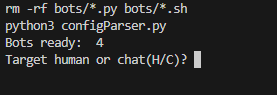
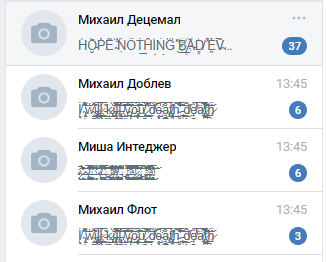
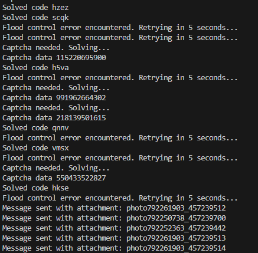

# Spam Kargo
This is a Python script that allows you to send messages with attachments to a specified chat or user in the VK social network. The script uses the vk_api and vk_captchasolver libraries to interact with the VK API and solve captchas, respectively.

## Installation
To use this script, you need to have Python installed on your computer. You can download Python from the official website: https://www.python.org/downloads/

Once you have Python installed, you can install the required libraries by running the following command in your terminal or command prompt:

- pip3 install -r requirements.txt
  
Or you can use pipenv

- pipenv install

This will install the vk_api, vk_captchasolver, and requests libraries.

## Usage
To use this script, you need to obtain an access token for your VK account. You can do this by following the instructions on the VK API documentation: https://vk.com/dev/access_token

Once you have obtained an access token, you can run the script by inserting the token in the **config.txt** file. Then, go to the src directory and run the script by following command: 

- make all

After that, you can choose the option to target a human (H) or group chat (C):

You can find out the vk id by the following link: https://regvk.com/id/

## Features
This script includes the following features:

**Sends messages with random attachments to a specified chat or user**

**Solves captchas using the vk_captchasolver library**

## Limitations
This script has the following limitations:

The script can only send messages with attachments to a single chat or user at a time
The script can't deal with anti-spam systems (Kai, Irirs, and etc.) in group chats

